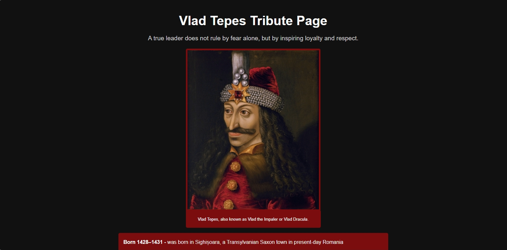

# 📜 Vlad Tepes Tribute Page

## 📖 Overview
This project is part of my FreeCodeCamp Responsive Web Design certification. The objective of this Tribute Page was to build a responsive webpage using only HTML and CSS while honoring a historical figure. I chose Vlad Tepes (Vlad the Impaler) because his complex legacy, feared for his harsh punishments, yet remembered in Romania as a strong leader who defended his land.

The focus of this project was clean structure, semantic HTML, responsive design, and a simple layout that adapts smoothly across various screen sizes.

## ✨ Features
- Responsive design that works on desktop, tablet, and mobile.
- Semantic HTML5 structure for accessibility.
- Styled headings, sections, and image with caption.
- Historical highlights about Vlad Țepeș (birth, reign, and death).
- A quote section with emphasis styling.
- External resource link for further reading.
- Footer credit section with developer link.

## 🛠️ Built With
- HTML – structure
- CSS – styling

## 🚀 How to Use
[`View Live Project`](https://vynxcode-ts.github.io/vlad-tepes-tribute-page/)

1. Explore the webpage for a photo and information about Vlad Tepes. (Known As, Born, Died, Known For)
2. To learn more you can click the "here" word to be redirected to an informational site (britannica).
3. Click Vynxcode in the footer to view more about the developer on Linktree.

## 📂 Project Structure
vlad-tepes-tribute-page/ `root folder`

│── index.html `main webpage` 

│── css/ `styling folder`

│   └── styles.css `styling` 

│── img/ `image folder`

│   └── website-favicon.png `favicon` 

│   └── website-preview.png `preview image` 

│── LICENSE `license details`

│── README.md `project details`  

## 📌 Learning Goals
- Practice semantic HTML elements (headings, sections, lists, figure, figcaption).
- Apply CSS styling for readability and emphasis.
- Use media queries to ensure responsiveness on tablets and phones.

## 🎯 Certification Compliance
This project fully meets all FreeCodeCamp Responsive Web Design
Tribute Page user stories and requirements.

## 📸 Preview

[`View Live Project`](https://vynxcode-ts.github.io/vlad-tepes-tribute-page/)

⚠️ Note: The main portrait of Vlad Țepeș used in this project is sourced from Wikimedia Commons
, which is in the public domain.

## 📄 License 
This project is provided for portfolio and educational review only. 
Copying, redistribution, or commercial use is prohibited. 

This project is licensed under a Vynxcode Proprietary License. 
See the [LICENSE](https://github.com/vynxcode-ts/vlad-tepes-tribute-page/blob/main/LICENSE) file for full terms.